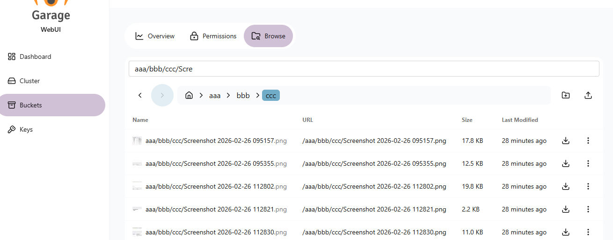

# Garage Web UI


A simple admin web UI for [Garage](https://garagehq.deuxfleurs.fr/), a self-hosted, S3-compatible, distributed object storage service.

[ [Screenshots](misc/SCREENSHOTS.md) | [Install Garage](https://garagehq.deuxfleurs.fr/documentation/quick-start/) | [Garage Git](https://git.deuxfleurs.fr/Deuxfleurs/garage) ]

## 🔍 Object Search
**Effortlessly navigate your storage.** 
The integrated search box allows you to perform **prefix-based searches**, making it simple to locate specific objects or folders even in buckets containing thousands of items.

[](misc/img/searchbox.png)

## Features

- Garage health status
- Cluster & layout management
- Create, update, or view bucket information
- Integrated object browser with prefix-based search
- Create & assign access keys

## Installation

The Garage Web UI is available as a single executable binary and docker image. You can install it using the command line or with Docker Compose.

### Docker CLI

```sh
$ docker run -p 3909:3909 -v ./garage.toml:/etc/garage.toml:ro --restart unless-stopped --name garage-webui jasonc08/garage-webui:latest
```

### Docker Compose

If you install Garage using Docker, you can install this web UI alongside Garage as follows:

```yml
services:
  garage:
    image: dxflrs/garage:v2.0.0
    container_name: garage
    volumes:
      - ./garage.toml:/etc/garage.toml
      - ./meta:/var/lib/garage/meta
      - ./data:/var/lib/garage/data
    restart: unless-stopped
    ports:
      - 3900:3900
      - 3901:3901
      - 3902:3902
      - 3903:3903

  webui:
    image: jasonc08/garage-webui:latest
    container_name: garage-webui
    restart: unless-stopped
    volumes:
      - ./garage.toml:/etc/garage.toml:ro
    ports:
      - 3909:3909
    environment:
      API_BASE_URL: "http://garage:3903"
      S3_ENDPOINT_URL: "http://garage:3900"
```
 

### Configuration

To simplify installation, the Garage Web UI uses values from the Garage configuration, such as `rpc_public_addr`, `admin.admin_token`, `s3_web.root_domain`, etc.

Example content of `config.toml`:

```toml
metadata_dir = "/var/lib/garage/meta"
data_dir = "/var/lib/garage/data"
db_engine = "sqlite"
metadata_auto_snapshot_interval = "6h"

replication_factor = 3
compression_level = 2

rpc_bind_addr = "[::]:3901"
rpc_public_addr = "localhost:3901" # Required
rpc_secret = "YOUR_RPC_SECRET_HERE"

[s3_api]
s3_region = "garage"
api_bind_addr = "[::]:3900"
root_domain = ".s3.domain.com"

[s3_web] # Optional, if you want to expose bucket as web
bind_addr = "[::]:3902"
root_domain = ".web.domain.com"
index = "index.html"

[admin] # Required
api_bind_addr = "[::]:3903"
admin_token = "YOUR_ADMIN_TOKEN_HERE"
metrics_token = "YOUR_METRICS_TOKEN_HERE"
```

However, if it fails to load, you can set `API_BASE_URL` & `API_ADMIN_KEY` environment variables instead.

### Environment Variables

Configurable envs:

- `CONFIG_PATH`: Path to the Garage `config.toml` file. Defaults to `/etc/garage.toml`.
- `BASE_PATH`: Base path or prefix for Web UI.
- `API_BASE_URL`: Garage admin API endpoint URL.
- `API_ADMIN_KEY`: Admin API key.
- `S3_REGION`: S3 Region.
- `S3_ENDPOINT_URL`: S3 Endpoint url.

### Authentication

Enable authentication by setting the `AUTH_USER_PASS` environment variable in the format `username:password_hash`, where `password_hash` is a bcrypt hash of the password.

Generate the username and password hash using the following command:

```bash
htpasswd -nbBC 10 "YOUR_USERNAME" "YOUR_PASSWORD"
```

> If command 'htpasswd' is not found, install `apache2-utils` using your package manager.

Then update your `docker-compose.yml`:

```yml
webui:
  ....
  environment:
    AUTH_USER_PASS: "username:$2y$10$DSTi9o..."
```

### Running

Once your instance of Garage Web UI is started, you can open the web UI at http://your-ip:3909. You can place it behind a reverse proxy to secure it with SSL.

## Development

This project is bootstrapped using TypeScript & React for the UI, and Go for backend. If you want to build it yourself or add additional features, follow these steps:

### Setup

```sh
$ git clone https://github.com/jasonc08/garage-webui.git
$ cd garage-webui && pnpm install
$ cd backend && pnpm install && cd ..
```

### Running

Start both the client and server concurrently:

```sh
$ pnpm run dev # or npm run dev
```

Or start each instance separately:

```sh
$ pnpm run dev:client
$ cd backend
$ pnpm run dev:server
```

 